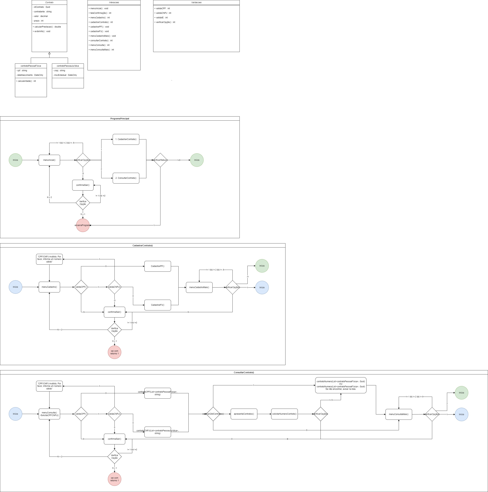

# Financeira
Projeto desenvolvido para a Avaliação do Módulo de Programação Orientada à Objetos da Let's Code conduzida pela Professora Angela Heredia.
1) Uma Financeira possui clientes pessoa física e pessoa jurídica. A Financeira precisa de um sistema para gerenciar os contratos de financiamento com seus clientes. Os contratos possuem número, nome do contratante, valor do contrato e prazo.

Crie uma classe contrato com os atributos idContrato ( Guid ), contratante ( string ), valor ( decimal ) e prazo ( int ).

1.1. ) Herança - Os contratos podem ser contrato de pessoa física e contrato de pessoa jurídica. Os contratos de pessoa física também tem o CPF  e a data de nascimento do contratante. Os contratos de pessoa jurídica possuem o CNPJ e a inscrição estadual da empresa contratante. Usando o conceito de herança, crie a classe ContratoPessoaFisica herdando da classe Contrato e com os atributos adicionais do Contrato Pessoa Física. Em seguida, crie a classe ContratoPessoaJuridica herdando da classe Contrato e com os atributos adicionais do Contrato Pessoa Jurídica.
Implemente as classes necessárias para representar os diferentes contratos da Financeira.

1.2. ) Polimorfismo - O valor da prestação de um contrato é calculado por um método calcularPrestação(), como sendo o valor do contrato dividido pelo prazo. Este método calcularPrestação() existe para todos os Contratos. Entretanto, para os contratos de pessoa jurídica existe um adicional de 3 reais no valor de cada prestação e para os contratos de pessoa física o valor da prestação também tem um adicional no valor da prestação que deve ser calculado de acordo com a idade do contratante:
idade <= 30 tem adicional de 1,00
idade <= 40 tem adicional de 2,00
idade <= 50 tem adicional de 3,00
idade > 50 tem adicional de 4,00
Implemente o método calcularPrestacao() na(s) classe(s) necessárias.
1.3 ) Mais métodos - Todos os contratos devem ter um método exibirInfo() ( que não retorna valor e que não tem parâmetros ) para informar o valor do contrato, o prazo e o valor da prestação. Além disso, os contratos de pessoa física devem informar também a idade do contratante.

<div aligns="center">

</div>

## Pontos de atenção
1) O programa foi criado de forma que o usuário não precisará explicitar se quer cadastrar um Contrato de PF ou PJ, com base na validação de CPF e CNPJ, ele irá conduzir o usuário no fluxo correto. Além disso, por conta destas validações, ele não permitirá a inclusão de contratos de CPFs e CNPJs inválidos.
2) O programa não permitirá o fechamento de contratos com dados incorretos:
- nome de contratante vazios;
- prazo <= 0;
- valores de contratos <= 0;
- data de nascimento futura (PF);
- inscrição estadual com número de dígitos diferente de 9 (PJ);

## Casos de teste

### Consulta de contratos sem ainda ter feito cadastro
```
input: 2
resultado esperado: "Não há contratos para exibir."
```

### Cadastro de data de nascimento inválida (copiar e texto abaixo dentro do Menu de Cadastro)
```
330.111.850-00
cpf com separadores
100,82
10
31/06/2024
30/06/1989
1

```

### Cadastro de CPF inválido (copiar e texto abaixo dentro do Menu de Cadastro)
```
330.111.850-05

```
### Cadastro de CNPJ inválido (copiar e texto abaixo dentro do Menu de Cadastro)
```
22439534000169
18.735.723/0001-19

```

### Cadastro de Nome de Contratante inválido (copiar e texto abaixo dentro do Menu de Cadastro)
```
58.735.723/0001-19
159.159.159.159
123.132.123

Tentativa de cadastro com nome de contratante inválido
777,77
7

```

### Cadastro de contratos com CPFs e CNPJs válidos para verificação de consulta (copiar e texto abaixo dentro do Menu de Cadastro)
```
330.111.850-00
cpf com separadores
100,82
10
15/06/1990
1

1
33011185000
CPF sem separadores
159.59
20
18/07/1953
1

42.439.534/0001-69
123123123123
CNP com separadores
500
500
1

42439534000169
456456456456
CNPJ sem separadores
399,99
300
1

58.735.723/0001-19
159.159.159
Teste com IE com Pontos
315,15
2

```
